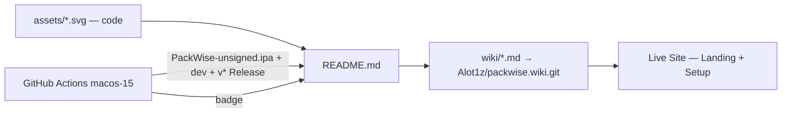
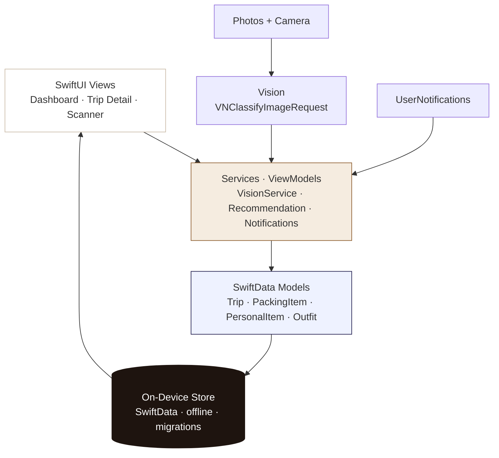

# PackWise — Your trips, on device.


<p>
  <a href="https://github.com/Alot1z/packwise/releases"></a>
  <a href="https://github.com/Alot1z/packwise/actions/workflows/ios.yml"></a>
  <a href="https://github.com/Alot1z/packwise/wiki"></a>
  
  
  
</p>

> **Private by design.** PackWise is a premium, native iOS packing assistant. Everything — trips, lists, photos, outfits, reminders — lives **on your iPhone**, works **offline**, and never requires an account or a cloud. The IPA is the product; everything else documents it.

**Download → [Latest Release · PackWise-unsigned.ipa](https://github.com/Alot1z/packwise/releases/latest)** · **Dev build → [dev prerelease · direct .ipa](https://github.com/Alot1z/packwise/releases/tag/dev)** · Actions artifact → `PackWise-unsigned-ipa.zip` (unwrap to get the `.ipa` inside) · Built free on `macos-15` + Xcode 16

---

## ⚠️ Got a `.zip` when you expected an `.ipa`?

**This is GitHub's artifact wrapping — not a bug in PackWise.** `upload-artifact` always puts your files inside an outer `.zip` container for download. Inside `PackWise-unsigned-ipa.zip` is the real `PackWise-unsigned.ipa` (which *is* a zip of `Payload/PackWise.app` renamed to `.ipa` — Apple spec).

| Source | What you download | How to get the `.ipa` |
|---|---|---|
| **Releases → Latest / dev** | `PackWise-unsigned.ipa` **directly** — 1 click, no unwrap | Click **Assets → PackWise-unsigned.ipa** |
| **Actions → artifact** | `PackWise-unsigned-ipa.zip` (container) | Download → unzip → `PackWise-unsigned.ipa` inside |

> From this update forward, **every push to `main` also publishes a `dev` prerelease** (`releases/tag/dev`) with the direct `.ipa` — so you never have to unwrap the artifact if you don't want to. Tag `v*` still creates versioned Releases.

Verify any IPA:

```bash
file PackWise-unsigned.ipa          # → Zip archive data
unzip -l PackWise-unsigned.ipa | head  # → Payload/PackWise.app/ ...
shasum -a 256 PackWise-unsigned.ipa
```

---

## Where to read what — one docs system, three surfaces

| Surface | What it's for | Link |
|---|---|---|
| **README** | Splash + install in 30 seconds — 3D art, quick start, links outward | You are here |
| **Wiki** | Deep, versioned docs — architecture, Vision internals, build logs, troubleshooting | [`github.com/Alot1z/packwise/wiki`](https://github.com/Alot1z/packwise/wiki) |
| **Live Preview Site** | Warm Athena Vite site — same content as README/Wiki, with setup wizard + live build status | [`src/pages/Landing.tsx`](./src/pages/Landing.tsx) → `bun run build` → `dist/` |

They combine: README embeds `assets/*.svg` (code, not screenshots). Wiki syncs from `wiki/*.md` on every push via `.github/workflows/wiki.yml`. The live site links to the same `releases/latest` + `releases/tag/dev` + `actions` URLs — no copy-paste drift.

<details>
<summary><strong>How they stay in sync</strong></summary>



- Push to `main` → `ios.yml` builds IPA → publishes **artifact** + **`dev` prerelease** (direct `.ipa`) → `wiki.yml` pushes `wiki/` to Wiki
- Tag `v*` → versioned Release with the same `.ipa`
- `vite build` produces a static `dist/` — deploy anywhere

</details>

---

## A 3D README — not just text

No screenshots. Every visual is **hand-written SVG** in `assets/` — diffable, scalable, no binary export.

| Art | File | Shows |
|---|---|---|
| **Isometric suitcase** — 3 floating layers | [`assets/packwise-hero.svg`](assets/packwise-hero.svg) | Clothing (62%) → Vision on-device → Outfit Day 2 |
| **Pipeline diagram** | [`assets/architecture.svg`](assets/architecture.svg) | SwiftUI → Services → SwiftData → On Device |
| **Social card** | [`assets/og-image.svg`](assets/og-image.svg) | 1200×630 `og:image` |

Gradients, shadows, and isometric projection are math (`viewBox`, `linearGradient`, `filter: dropShadow`). Edit the SVG to change the art.

---

## Install in 3 steps — no tech needed

> The IPA is **unsigned** — your sideload tool re-signs it locally. Normal for open-source iOS apps.

**1 · Download** — **[Releases → Latest](https://github.com/Alot1z/packwise/releases/latest)** → `PackWise-unsigned.ipa`. Prefer the auto-updating build? → **[dev · latest main](https://github.com/Alot1z/packwise/releases/tag/dev)**. Or Actions artifact (`unzip` to get the `.ipa`).

**2 · Open sideload tool**
- **AltStore:** AltServer on Mac/PC → connect iPhone → AltStore → *My Apps* → **+** → select `.ipa`.
- **Sideloadly:** Drag `.ipa` → Apple ID for local signing → Start.
- **TrollStore** (supported OS): TrollStore → **+** → select `.ipa` — no re-sign.

**3 · Trust & open** — *Settings → General → VPN & Device Management* → trust → open PackWise.

---

## What's inside the IPA — everything on device


**Trips** (title, destination, dates, activities, climate, status `planning`/`packing`/`ready`/`archived`, duplicate, template) ·
**Lists** (Clothing/Electronics/Toiletries/Documents/Medical/Accessories/Outdoor + custom, qty, essentials, packed, progress, search/sort/filter) ·
**Library** (photo, notes, favorites, reuse) ·
**Vision Scanner** (local `VNClassifyImageRequest` → **you confirm** before add) ·
**Outfits** (day assignment, preview) ·
**Dashboard** (upcoming, progress, missing) ·
**Search** (trips/items/outfits/templates, offline) ·
**Templates** (Weekend/Business/Beach/Hiking/International + custom) ·
**Reminders** (local `UserNotifications`)

No browser packing. No cloud AI. The site is docs — the IPA is the app. Full fields → [Wiki → Features](https://github.com/Alot1z/packwise/wiki/Features).

---

## Architecture — native, offline, testable



**Stack:** Swift + SwiftUI · SwiftData · Vision + VisionKit · Photos + Camera · UserNotifications · WidgetKit optional · MVVM + `Services/` · XcodeGen · iOS 17+

**Navigation (no dead screens):** Launch → Onboarding → **Dashboard** → **Trips** → **Trip Detail** → **Item Detail** → **Scanner** → **Outfit** → **Library** → **Search** → **Templates** → **Reminders** → **Settings** · Light/Dark · Dynamic Type · VoiceOver · iPhone + iPad

→ [Wiki → Architecture](https://github.com/Alot1z/packwise/wiki/Architecture) · [Wiki → Data Models](https://github.com/Alot1z/packwise/wiki/Data-Models)

---

## For developers — build from source (reproducible)

<details>
<summary><strong>Quick build</strong></summary>

```bash
brew install xcodegen
cd ios && xcodegen generate && open PackWise.xcodeproj

# Tests (non-blocking in CI — IPA still builds if tests flake)
xcodebuild test -project PackWise.xcodeproj -scheme PackWise \
  -destination "platform=iOS Simulator,name=iPhone 16,OS=latest" CODE_SIGNING_ALLOWED=NO

# Unsigned IPA — same as CI (archive + DerivedData fallback)
./ios/build.sh   # → ios/build/PackWise-unsigned.ipa + .sha256
file ios/build/PackWise-unsigned.ipa && unzip -l ios/build/PackWise-unsigned.ipa | head
```

</details>

**Three equal hosts — same artifact** (`Payload/PackWise.app` → `PackWise-unsigned.ipa`):

```bash
# 1) GitHub Actions — no Mac needed on your side
git push origin main                          # → artifact + dev prerelease (direct .ipa)
git tag v1.0.0 && git push origin v1.0.0      # → versioned Release

# Direct download without unwrapping (after a main push):
gh release download dev -R Alot1z/packwise -p "PackWise-unsigned.ipa"  # or Latest: gh release download -R Alot1z/packwise -p "*.ipa"

# 2) Gitea Actions — self-hosted FOSS
git remote add gitea https://YOUR_GITEA/YOU/packwise.git && git push gitea main

# 3) act locally — fully offline after clone (Mac + Xcode required)
brew install act
act -W .github/workflows/ios.yml -P macos-15=-self-hosted
```

→ [Wiki → Build & Release](https://github.com/Alot1z/packwise/wiki/Build-and-Release) · [`ios/README.md`](ios/README.md) · Live logs: [`Actions`](https://github.com/Alot1z/packwise/actions)

### Project layout

```
assets/               # 3D SVGs — art is code
ios/                  # Native iOS app — the product
  PackWise/           # SwiftUI app (Models, Views, Services)
  PackWiseTests/ · PackWiseUITests/
  project.yml         # XcodeGen → PackWise.xcodeproj
  build.sh            # Reproducible IPA (archive + fallback + validation)
wiki/                 # Wiki source — synced to Alot1z/packwise.wiki
src/                  # Live docs site only (Vite + Tailwind) — not the app
.github/workflows/    # ios.yml (build) + wiki.yml (docs sync)
.gitea/workflows/     # Mirror for Gitea Actions
```

### Live docs site

```bash
bun install && bun run build   # → dist/ (deploy to Pages/Netlify/any static host)
```

The Freebuff preview is that `dist/` — it imports `assets/*.svg` and links to `releases/latest` + `releases/tag/dev`.

---

## Troubleshooting

- **Download was a `.zip`?** → That's the artifact container. The direct `.ipa` is on [Releases Latest](https://github.com/Alot1z/packwise/releases/latest) or [dev](https://github.com/Alot1z/packwise/releases/tag/dev). If you used the artifact, unzip it.
- **No IPA artifact?** → Open the *Archive — unsigned IPA* step logs — fallback diagnostics + `unzip -l` now always print.
- **Install fails / Untrusted Developer** → Re-sign via AltStore/Sideloadly, or use TrollStore where supported.
- **Vision finds nothing** → Clearer, well-lit photo; on-device Vision is conservative.

Full → [Wiki → Troubleshooting](https://github.com/Alot1z/packwise/wiki/Troubleshooting)

---

## Honesty

- No IPA advertised until a workflow has produced it.
- No TestFlight / App Store claimed — requires Apple signing + App Store Connect.

## Open source

MIT — no paid APIs, no data collection. Art in `assets/` is original SVG.

- **Issues:** https://github.com/Alot1z/packwise/issues · **Releases:** https://github.com/Alot1z/packwise/releases · **Actions:** https://github.com/Alot1z/packwise/actions · **Wiki:** https://github.com/Alot1z/packwise/wiki
