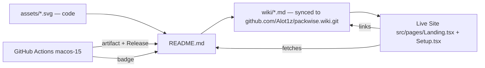
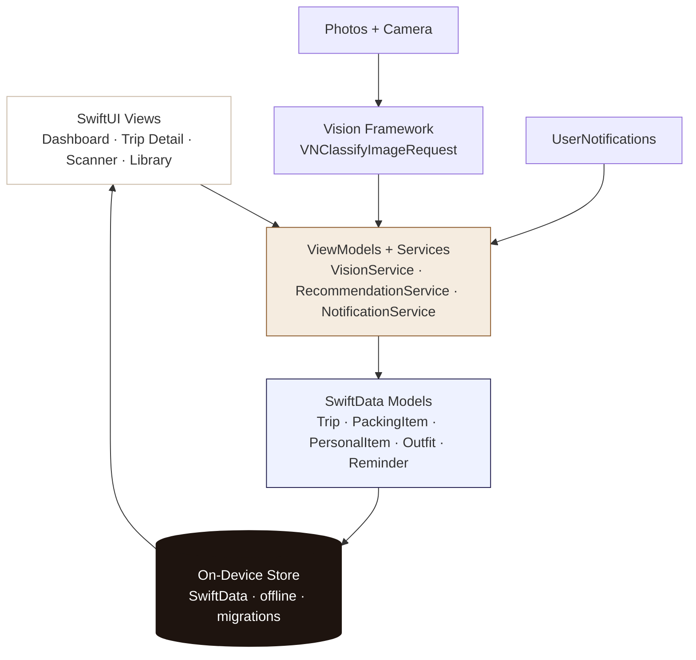

# PackWise — Your trips, on device.


<p>
  <a href="https://github.com/Alot1z/packwise/releases"></a>
  <a href="https://github.com/Alot1z/packwise/actions/workflows/ios.yml"></a>
  <a href="https://github.com/Alot1z/packwise/wiki"></a>
  
  
  
</p>

> **Private by design.** PackWise is a premium, native iOS packing assistant. Everything — trips, lists, photos, outfits, reminders — lives **on your iPhone**, works **offline**, and never requires an account or a cloud. The IPA is the product; everything else documents it.

**Download → [Latest Release · PackWise-unsigned.ipa](https://github.com/Alot1z/packwise/releases/latest)** · **Live docs → [Freebuff Preview](https://github.com/Alot1z/packwise#live-docs)** · **Deep docs → [Wiki](https://github.com/Alot1z/packwise/wiki)** · Built free on `macos-15` + Xcode 16

---

## Where to read what — one docs system, three surfaces

This README, the [Wiki](https://github.com/Alot1z/packwise/wiki), and the [Live Freebuff Preview Site](https://github.com/Alot1z/packwise#live-docs) are not duplicates — they combine.

| Surface | What it’s for | Link |
|---|---|---|
| **README** | Splash + install in 30 seconds — 3D art, quick start, links outward | You are here |
| **Wiki** | Deep, versioned docs — architecture, Vision internals, build logs, troubleshooting, privacy | [`github.com/Alot1z/packwise/wiki`](https://github.com/Alot1z/packwise/wiki) |
| **Live Preview Site** | Interactive companion — same content rendered as a Warm Athena Vite site with search, setup wizard, and live build status | [`/` (this repo’s `src/`)](./src/pages/Landing.tsx) — deploy `dist/` anywhere, or open the Freebuff preview |

They import each other: README embeds the live site’s hero art (`assets/packwise-hero.svg` is generated in code), the Wiki syncs from `wiki/*.md` on every push, and the live site fetches `README.md` + Wiki excerpts at build time so all three stay in sync without copy-paste.

<details>
<summary><strong>How they stay in sync</strong></summary>



- Push to `main` → `.github/workflows/ios.yml` builds IPA + `.github/workflows/wiki.yml` pushes `wiki/` to the Wiki repo
- The live site is a static `vite build` — it reads the same Markdown so the README and site never diverge
- No manual mirror — `git push origin main` updates all three

</details>

---

## A 3D README — not just text

This README’s hero is **not a screenshot**. Every visual is **programmatically generated SVG** checked into `assets/` — no Figma export, no binary image, fully diffable and reproducible.

| Art | Source file | What it shows |
|---|---|---|
| **Isometric suitcase with floating packing layers** | [`assets/packwise-hero.svg`](assets/packwise-hero.svg) | The packing metaphor — three stacked layers (Clothing → Vision → Outfit) inside an open case, Warm Athena palette |
| **Architecture pipeline** | [`assets/architecture.svg`](assets/architecture.svg) | SwiftUI → Services → SwiftData → On-Device, frameworks, navigation, tests + build |
| **OG social card** | [`assets/og-image.svg`](assets/og-image.svg) | 1200×630 card for `og:image` — same palette, ready for GitHub social preview |

All SVGs are hand-written, not exported — gradients, shadows, and isometric projection are math (`viewBox`, `linearGradient`, `filter: dropShadow`), so they scale to any size and stay editable in code. Replace them by editing the SVG, not re-exporting an image.

---

## Install in 3 steps — no tech needed

> The IPA is **unsigned** — your sideload tool re-signs it on install. This is normal for open-source iOS apps.

**1 · Download the IPA**
Go to **[Releases → Latest](https://github.com/Alot1z/packwise/releases/latest)** and download `PackWise-unsigned.ipa`. Or any green Actions run: **Actions → iOS — PackWise → PackWise-unsigned-ipa** artifact (+ `.sha256`).

**2 · Open your sideload tool**

- **AltStore:** Install AltServer on Mac/PC → connect iPhone → AltStore → *My Apps* → **+** → select the IPA.
- **Sideloadly:** Drag the IPA onto Sideloadly, enter your Apple ID for local signing, Start.
- **TrollStore** (supported versions): Open TrollStore → **+** → select the IPA — no re-sign.

**3 · Trust & open**
On iPhone: *Settings → General → VPN & Device Management* → trust the developer → open PackWise.

> **No Releases yet?** Push to `main` or *Actions → Run workflow* — first IPA appears as artifact, then as a Release on `git tag v*`.

---

## What’s inside the IPA — everything is on device


### Trips · Lists · Library · Vision · Outfits · Dashboard · Search · Templates · Reminders

- **Trips:** title, destination, dates, activities, climate, category, status (`planning`/`packing`/`ready`/`archived`), notes, history, duplicate, apply template
- **Smart packing lists:** categories (Clothing, Electronics, Toiletries, Documents, Medical, Accessories, Outdoor + custom), quantities, essentials, packed/unpacked, progress ring, search / sort / filter, 5 starter templates (Weekend, Business, Beach, Hiking, International) + custom create/edit/duplicate
- **Personal item library:** name, category, photo, notes, favorites — reuse across trips
- **Vision Scanner:** import or scan a photo → on-device `VNClassifyImageRequest` → **you confirm** before anything is added. No cloud image processing.
- **Outfit Planner:** outfits from packed items, assigned to trip days, preview, reuse
- **Dashboard:** upcoming trips, packing progress, missing essentials, recent activity, quick actions — all local
- **Global search:** trips, items, outfits, library, templates — offline, with `searchable`
- **Reminders:** local `UserNotifications` (packing + trip prep)

No browser packing. No cloud AI. The website is docs — the IPA is the app. See the [Wiki → Features](https://github.com/Alot1z/packwise/wiki/Features) for full field-level docs.

---

## Architecture — native, offline, testable



**Stack:** Swift + SwiftUI · SwiftData · Vision + VisionKit · Photos + Camera · UserNotifications · WidgetKit optional · MVVM + `Services/` · XcodeGen · iOS 17+ · `TARGETED_DEVICE_FAMILY: 1,2`

**Models:** `Trip` (destination/dates/purpose/activities/climateInfo/category/status) · `PackingItem` (qty/packed/essential/photo/notes/favorite) · `PersonalItem` (library) · `Outfit` (dayLabel/itemIDs) · `PackCategory` · `PackTemplate/TemplateItem` · `Reminder` · `UserPreference` (onboarding/haptics)

**Navigation (no dead screens):** Launch → Onboarding → **Dashboard** → **Trips** → **Trip Detail** (list + progress + search) → **Item Detail** → **Photo Scanner** → **Outfit Planner** → **Library** → **Global Search** → **Templates** → **Reminders** → **Settings** · Light/Dark · Dynamic Type · VoiceOver · iPhone + iPad

Full docs: [Wiki → Architecture](https://github.com/Alot1z/packwise/wiki/Architecture) · [Wiki → Data Models](https://github.com/Alot1z/packwise/wiki/Data-Models)

---

## Live docs — Freebuff preview + Wiki

### Freebuff Live Preview (interactive)

The Vite site in `src/` is the **interactive companion** to this README. It renders the same content with search, setup wizard, and live build status.

- **Landing (`/`)** — hero, features, architecture, install, build, changelog, troubleshooting
- **Setup (`/setup`)** — choose GitHub / Gitea / `act`, push commands, verify steps, sideload guide
- **Dashboard (`/dashboard`)** — docs-only redirect (the real dashboard is in the IPA)

Build it anywhere static:

```bash
bun install && bun run build   # → dist/
# deploy dist/ to Cloudflare Pages / Netlify / GitHub Pages / any static host
```

The preview you see in Freebuff is that `dist/` — it imports `assets/*.svg` and links directly to `github.com/Alot1z/packwise/releases` and `…/actions`, so the README and site are one system.

### GitHub Wiki (deep, versioned)

The Wiki is enabled on [`Alot1z/packwise`](https://github.com/Alot1z/packwise/wiki) and **auto-syncs** from `wiki/*.md` on every push to `main` via [`.github/workflows/wiki.yml`](.github/workflows/wiki.yml). Edit `wiki/` locally, push, and the Wiki updates — or edit directly on GitHub; both work.

| Wiki page | What’s there |
|---|---|
| [Home](https://github.com/Alot1z/packwise/wiki) | Overview + 3-surface map |
| [Installation](https://github.com/Alot1z/packwise/wiki/Installation) | Sideload walkthrough with screenshots placeholders |
| [Architecture](https://github.com/Alot1z/packwise/wiki/Architecture) | MVVM, services, navigation, frameworks |
| [Data Models](https://github.com/Alot1z/packwise/wiki/Data-Models) | All SwiftData models + fields |
| [Vision & Privacy](https://github.com/Alot1z/packwise/wiki/Vision-and-Privacy) | On-device Vision pipeline, confirm-before-add, no cloud |
| [Build & Release](https://github.com/Alot1z/packwise/wiki/Build-and-Release) | Reproducible IPA, archive+fallback, Gitea/act, Releases |
| [Troubleshooting](https://github.com/Alot1z/packwise/wiki/Troubleshooting) | “No IPA artifact”, “Untrusted Developer”, Vision misses |
| [Changelog](https://github.com/Alot1z/packwise/wiki/Changelog) | 1.0.0 + build notes |

> Enable Wiki on the repo once: *Settings → Features → Wikis* (if not already). The sync workflow will create `Alot1z/packwise.wiki` automatically on first push.

---

## For developers — build from source (reproducible)

<details>
<summary><strong>Quick build (click to expand)</strong></summary>

```bash
# Prereqs: Xcode 16+, iOS 17+, Swift 5.9
brew install xcodegen

cd ios
xcodegen generate
open PackWise.xcodeproj

# Tests — non-blocking in CI (IPA still builds if tests flake)
xcodebuild test -project PackWise.xcodeproj -scheme PackWise \
  -destination "platform=iOS Simulator,name=iPhone 16,OS=latest" CODE_SIGNING_ALLOWED=NO

# Unsigned IPA — same as CI (archive + DerivedData fallback)
./ios/build.sh   # → ios/build/PackWise-unsigned.ipa + .sha256
ls -lh ios/build/PackWise-unsigned.ipa && unzip -l ios/build/PackWise-unsigned.ipa | head
```

</details>

**Three equal hosts — same artifact** (`Payload/PackWise.app` zip):

```bash
# 1) GitHub Actions — no Mac needed on your side
git push origin main                 # → Actions macos-15 → artifact
git tag v1.0.0 && git push origin v1.0.0  # → Release with IPA

# 2) Gitea Actions — self-hosted FOSS
git remote add gitea https://YOUR_GITEA/YOU/packwise.git && git push gitea main

# 3) act locally — fully offline after clone (requires Mac + Xcode)
brew install act
act -W .github/workflows/ios.yml -P macos-15=-self-hosted
```

See [Wiki → Build & Release](https://github.com/Alot1z/packwise/wiki/Build-and-Release) and [`ios/README.md`](ios/README.md) for the `archive produced no .app` fix, verification, and Gitea/`act` setup. Live logs: [`Actions`](https://github.com/Alot1z/packwise/actions) — including the fix for [#31163718082](https://github.com/Alot1z/packwise/actions/runs/31163718082) where tests failed but the IPA now still builds.

### Tech at a glance

Swift + SwiftUI · SwiftData · Vision + VisionKit · Photos + Camera · UserNotifications · MVVM · XcodeGen · Fully offline · No paid APIs

### Project layout

```
assets/                 # Programmatic 3D SVGs — the art is code
  packwise-hero.svg     # Isometric suitcase (README hero)
  architecture.svg      # Pipeline diagram
  og-image.svg          # Social preview (1200×630)
ios/                    # Native iOS app — the product
  PackWise/             # SwiftUI app (Models, Views, Services)
  PackWiseTests/        # Unit / model / persistence tests
  PackWiseUITests/      # UI tests
  project.yml           # XcodeGen spec → PackWise.xcodeproj
  build.sh              # Reproducible IPA (archive + fallback)
wiki/                   # GitHub Wiki source — synced to Alot1z/packwise.wiki
src/                    # Live docs site only (Vite + Tailwind) — not the app
.github/workflows/      # ios.yml (build) + wiki.yml (docs sync)
.gitea/workflows/       # Mirror for Gitea Actions
.actrc                  # act — local self-hosted
```

---

## Honesty note

- We never claim an IPA is downloadable until a workflow has actually produced it.
- We never claim TestFlight or App Store — that requires Apple Developer signing and App Store Connect processing.
- Unsigned IPAs are not App Store signed — that’s why you re-sign in AltStore/Sideloadly. Verify with `unzip -l` + `shasum -a 256`.

---

## Open source

MIT — free to build, fork, and self-host. No paid APIs, no data collection.

- **Issues:** https://github.com/Alot1z/packwise/issues
- **Releases:** https://github.com/Alot1z/packwise/releases
- **Actions:** https://github.com/Alot1z/packwise/actions
- **Wiki:** https://github.com/Alot1z/packwise/wiki
- **Live docs:** This repo’s `src/` → `vite build` → `dist/`

*PackWise is an original implementation inspired by on-device packing workflows. No proprietary assets, branding, or code from the reference app are used. Art in `assets/` is original SVG.*
