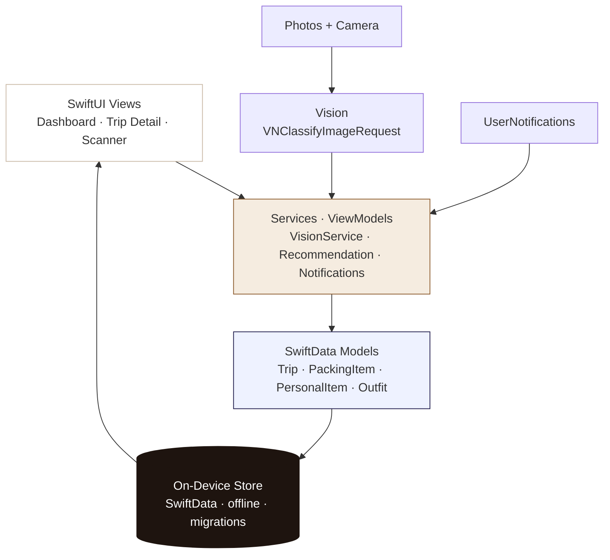
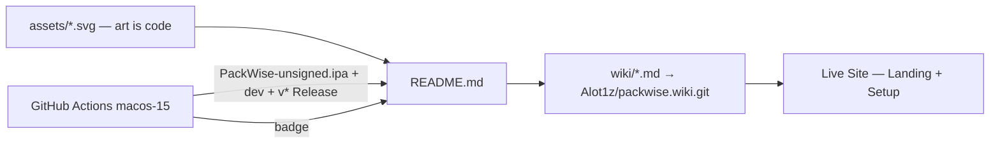

# 🧳 PackWise — Your trips, on device.


<p>
  <a href="https://github.com/Alot1z/packwise/releases"></a>
  <a href="https://github.com/Alot1z/packwise/actions/workflows/ios.yml"></a>
  <a href="https://github.com/Alot1z/packwise/wiki"></a>
  
  
  
</p>

> **Private by design.** PackWise is a premium, native iOS packing assistant. Every trip, packing list, photo, outfit, template and reminder lives **on your iPhone**, works **fully offline**, and never requires an account, a cloud, or an external AI. The IPA is the product — everything else in this repository only documents it.

**Download → [Latest Release · `PackWise-unsigned.ipa`](https://github.com/Alot1z/packwise/releases/latest)** · **Auto-updating dev build → [`dev` · direct .ipa](https://github.com/Alot1z/packwise/releases/tag/dev)** · Built free on `macos-15` + Xcode 16 · Art in `assets/` is 100% programmatic SVG.

---

## 🚀 The 30-second story (no tech needed)

PackWise helps you **stop forgetting things** when you travel. You create a trip, tick off what you packed, snap a photo of anything and let **on-device Vision** suggest items — and PackWise remembers what you always forget: chargers, adapters, essentials. Everything stays on your phone. No sign-up. No Wi-Fi needed. No data leaves your device.

This repository gives you **three things in one**:

| What | Where | Who it's for |
|---|---|---|
| **The app** (`.ipa`) | [Releases](https://github.com/Alot1z/packwise/releases) — build it or download a build | iPhone users |
| **The manual** (deep docs) | [📖 Wiki](https://github.com/Alot1z/packwise/wiki) — 8 pages | Everyone |
| **The live site** (interactive) | Freebuff preview — links, setup wizard, live build status | Everyone |

They're one system, not copies — see [One docs system, three surfaces](#-one-docs-system-three-surfaces).

---

## ⚠️ Got a `.zip` when you expected an `.ipa`?

**This is GitHub's artifact wrapping — not a PackWise bug.** Action downloads always arrive inside an outer `.zip` container. The real `PackWise-unsigned.ipa` (which is a zip of `Payload/PackWise.app` — Apple's spec) is inside.

| Source | What you download | How to get the `.ipa` |
|---|---|---|
| **Releases → Latest / dev** | `PackWise-unsigned.ipa` **directly** — 1 click, no unwrap | Click **Assets → PackWise-unsigned.ipa** |
| **Actions → artifact** | `PackWise-unsigned-ipa.zip` (container) | Download → **unzip once** → `.ipa` inside |

> From this update forward, **every push to `main` publishes a `dev` prerelease** (`releases/tag/dev`) with the direct `.ipa` — you never have to unwrap the artifact if you don't want to. Tags `v*` still create versioned Releases.

Verify any download — one command (auto-unwraps artifact zips):

```bash
./scripts/verify-ipa.sh <downloaded-file>   # → "✓ sideload-ready" or exactly why not
```

…or manually:

```bash
file PackWise-unsigned.ipa            # → Zip archive data (correct — .ipa IS a zip)
unzip -l PackWise-unsigned.ipa | head # → Payload/PackWise.app/ ...
shasum -a 256 PackWise-unsigned.ipa
```

---

## 📲 Install in 3 steps — no tech needed

> The IPA is **unsigned** — your sideload tool re-signs it locally on your own Apple ID. This is completely normal for open-source iOS apps.

**1 · Download the app**
[Releases → Latest](https://github.com/Alot1z/packwise/releases/latest) → `PackWise-unsigned.ipa`. Prefer always-fresh? → [`dev` · latest main](https://github.com/Alot1z/packwise/releases/tag/dev).

**2 · Open it with a sideload tool**

<details>
<summary><strong>AltStore</strong> — the friendliest option</summary>

1. Install [AltServer](https://altstore.io) on a Mac or PC.
2. Connect your iPhone to the same computer (Wi-Fi or cable).
3. Open **AltStore** on your iPhone → **My Apps** → tap **+** → select the `.ipa`.
4. AltStore re-signs it with your Apple ID and installs it.

</details>

<details>
<summary><strong>Sideloadly</strong> — works on Windows and macOS</summary>

1. Install [Sideloadly](https://sideloadly.io).
2. Drag the `.ipa` onto the window.
3. Enter your Apple ID (it is only used to sign locally), hit **Start**, and wait for the install.

</details>

<details>
<summary><strong>TrollStore</strong> — no re-signing at all (where supported)</summary>

Open **TrollStore** → **+** → select the `.ipa`. Done — no Apple ID needed on supported iOS versions.

</details>

**3 · Trust & open**
*Settings → General → VPN & Device Management* → tap your developer profile → **Trust** → open PackWise. ✈️

> Transfer the `.ipa` to your iPhone via AirDrop, Files, or a computer, then open it in your sideload tool. iOS 17 or later required.

---

## ✅ Verified build status — inspected, not assumed

We don't claim a working IPA until a build has been **inspected byte-for-byte**. Here's what we check on every published artifact:

| Check | Why it matters |
|---|---|
| `Payload/PackWise.app/PackWise` exists, non-empty | A missing executable is exactly the `Failed to map …/PackWise: Bad file descriptor` sideload failure |
| Binary is **arm64 device** Mach-O (`LC_BUILD_VERSION platform 2`, never 7 = simulator) | Simulator binaries cannot run on a physical iPhone |
| **No test bundles** (`*.xctest`, `XCTest`/`XCUnit`/`XCUIAutomation`/`Testing` frameworks) | Test injection bloats the app and breaks sideloading |
| `unzip -t` integrity + `shasum -a 256` published alongside | You can verify your download matches |

The pipeline **refuses to publish** anything that fails these checks — a broken build fails loudly with readable diagnostics (also uploaded as the `ios-build-diagnostics` artifact so anyone can read why).

```bash
# Inspect the current dev build right now:
curl -L -o PackWise.ipa https://github.com/Alot1z/packwise/releases/download/dev/PackWise-unsigned.ipa
./scripts/verify-ipa.sh PackWise.ipa                    # → sideload-ready verdict
unzip -l PackWise.ipa | grep -E "Payload/PackWise.app/(PackWise|Info.plist)"   # both must appear
shasum -a 256 PackWise.ipa   # compare with the .sha256 asset on the same release
```

---

## 🎒 What's inside the IPA — everything on device


**Trips** — title, destination, dates, activities, climate, status (`planning`/`packing`/`ready`/`archived`), duplicate, apply templates ·
**Lists** — Clothing / Electronics / Toiletries / Documents / Medical / Accessories / Outdoor + custom categories, quantities, essentials, packed state, live progress, search/sort/filter ·
**Library** — reusable personal items with photos, notes, favorites ·
**Vision Scanner** — on-device `VNClassifyImageRequest`: photo → suggestions → **you confirm** before anything is added. No cloud, no silent changes ·
**Outfits** — day-by-day outfit planning from packed items ·
**Dashboard** — upcoming trips, packing progress, missing essentials ·
**Search** — trips, items, outfits, templates — fully offline ·
**Templates** — Weekend, Business, Beach, Hiking, International + custom ·
**Reminders** — local `UserNotifications`, no servers.

No browser packing. No cloud AI. No telemetry. The site is docs — the IPA is the app. Full field-level detail → [Wiki → Features](https://github.com/Alot1z/packwise/wiki/Features).

---

## 🏗 Architecture — native, offline, testable



**Stack:** Swift + SwiftUI · SwiftData · Vision + VisionKit · Photos + Camera · UserNotifications · MVVM + `Services/` · XcodeGen · iOS 17+

**Navigation (no dead screens):** Launch → Onboarding → **Dashboard** → **Trips** → **Trip Detail** → **Item Detail** → **Scanner** → **Outfit** → **Library** → **Search** → **Templates** → **Reminders** → **Settings** · Light/Dark · Dynamic Type · VoiceOver · iPhone + iPad

→ [Wiki → Architecture](https://github.com/Alot1z/packwise/wiki/Architecture) · [Wiki → Data Models](https://github.com/Alot1z/packwise/wiki/Data-Models) · [Wiki → Vision & Privacy](https://github.com/Alot1z/packwise/wiki/Vision-and-Privacy)

---

## 🔗 One docs system, three surfaces

The README, the Wiki, and the live site are **the same documentation rendered three ways** — no copy-paste drift:

| Surface | What it's for | Link |
|---|---|---|
| **README** | Splash + 30-second install — 3D art, quick start, FAQ | You are here |
| **Wiki** | Deep, versioned docs — architecture, Vision internals, build logs, troubleshooting | [`Alot1z/packwise/wiki`](https://github.com/Alot1z/packwise/wiki) |
| **Live Preview Site** | Interactive landing, setup wizard, live build status — links straight to the same Releases | `src/` → Vite build |



- Push to `main` → `ios.yml` builds & validates the IPA → publishes **artifact** + **`dev` prerelease** (direct `.ipa`) → `wiki.yml` syncs `wiki/` to the Wiki
- Tag `v*` → versioned Release with the same `.ipa`
- The live site imports `assets/*.svg` and links to the same `releases/latest`, `releases/tag/dev`, and `actions` URLs — one source of truth

---

## 🖼 Art is code

No screenshots. Every visual in this README is a **hand-written SVG** in `assets/` — diffable, scalable, no binary exports:

| Art | File | Shows |
|---|---|---|
| Isometric suitcase — 3 floating layers | [`assets/packwise-hero.svg`](assets/packwise-hero.svg) | Clothing (62%) → Vision on-device → Outfit Day 2 |
| Pipeline diagram | [`assets/architecture.svg`](assets/architecture.svg) | SwiftUI → Services → SwiftData → On Device |
| Social card | [`assets/og-image.svg`](assets/og-image.svg) | 1200×630 `og:image` |

Gradients, shadows and isometric projection are math (`viewBox`, `linearGradient`, `filter: dropShadow`) — edit the SVG to change the art.

---

## 👩‍💻 For developers — build from source (reproducible)

<details>
<summary><strong>Quick build</strong></summary>

```bash
brew install xcodegen
cd ios && xcodegen generate && open PackWise.xcodeproj

# Tests (non-blocking in CI — the IPA still builds if tests flake)
xcodebuild test -project PackWise.xcodeproj -scheme PackWise \
  -destination "platform=iOS Simulator,name=iPhone 16,OS=latest" CODE_SIGNING_ALLOWED=NO

# Unsigned IPA — same self-healing pipeline as CI
./ios/build.sh   # → ios/build/PackWise-unsigned.ipa + .sha256
file ios/build/PackWise-unsigned.ipa && unzip -l ios/build/PackWise-unsigned.ipa | head
```

</details>

**Three equal hosts — same validated artifact** (`Payload/PackWise.app` → `PackWise-unsigned.ipa`):

```bash
# 1) GitHub Actions — no Mac needed on your side
git push origin main                          # → artifact + dev prerelease (direct .ipa)
git tag v1.0.0 && git push origin v1.0.0      # → versioned Release

# Direct download without unwrapping (after a main push):
gh release download dev -R Alot1z/packwise -p "PackWise-unsigned.ipa"

# 2) Gitea Actions — self-hosted FOSS (same YAML, runs-on: macos)
git remote add gitea https://YOUR_GITEA/YOU/packwise.git && git push gitea main

# 3) act locally — fully offline after clone (Mac + Xcode required)
brew install act
act -W .github/workflows/ios.yml -P macos-15=-self-hosted
```

> **Why three build strategies?** Xcode 16 with `CODE_SIGNING_ALLOWED=NO` can exit 0 while emitting an app bundle *without the main executable* (or with test bundles injected) — the exact cause of the old “Bad file descriptor” sideload failure. `ios/build.sh` therefore tries **device build → archive → legacy build**, validates the executable (exists, non-empty, arm64, `platform 2`), strips test injection, and **refuses to publish** anything that fails the gate. Diagnostics are always written to `ios/build/diagnostics.txt` and uploaded by CI.

→ [Wiki → Build & Release](https://github.com/Alot1z/packwise/wiki/Build-and-Release) · [`ios/README.md`](ios/README.md) · Live logs: [`Actions`](https://github.com/Alot1z/packwise/actions)

### Project layout

```
assets/               # 3D SVGs — art is code
ios/                  # Native iOS app — the product
  PackWise/           # SwiftUI app (App, Models, Services, Views)
  PackWiseTests/ · PackWiseUITests/
  Resources/Assets.xcassets/AppIcon.appiconset/  # programmatic 1024px icon
  project.yml         # XcodeGen → PackWise.xcodeproj
  build.sh            # Self-healing IPA: build → archive → legacy + strict gate
scripts/              # generate-appicon.py (icon is code) + verify-ipa.sh (verify any download) + release-manifest.sh (algorithm-friendly JSON)
wiki/                 # Wiki source — synced to Alot1z/packwise.wiki
src/                  # Live docs site only (Vite + Tailwind) — not the app
.github/workflows/    # ios.yml (build+release) + wiki.yml (docs sync)
.gitea/workflows/     # Mirror for Gitea Actions
```

### Live docs site

```bash
bun install && bun run build   # → dist/ (deploy to Pages/Netlify/any static host)
```

---

## 🚀 Release process — the maintainer's streamlined flow

This is the actual workflow you run as the owner. Every push and every tag is bound to a single source of truth (the code on `main`) and gated by `.github/workflows/ios.yml` — there is no separate script you need to remember to call, and no manual publish step.

| Trigger | What CI runs | What gets published | Why |
|---|---|---|---|
| **push to `main`** | tests (non-blocking) → device-build → archive → legacy-build cascade → `verify-ipa.sh` strict gate → manifest | `ios-build-diagnostics` artifact **+** `PackWise-unsigned.ipa` artifact **+** `dev` prerelease (the **direct `.ipa`**, no unwrapping by users) | Every green push gives operators and sideloaders a fresh, verifiable build with zero latency between merge and artifact |
| **`v*` tag** | same build + gate | versioned **GitHub Release** with `PackWise-unsigned.ipa`, `PackWise-releases.json`, and auto-generated notes | `v`-tags stay upstream of the dev stream so the dev release is always `>=` last tagged |
| **manual *Run workflow*** on the Actions tab (inputs: `xcode_version`, `skip_tests`, `release_channel`) | same cascade with operator-chosen overrides | artifact + `dev` by default; `auto` selects `dev` if no prior versioned release exists, otherwise the next-tag release | Ad-hoc re-builds without merge noise — useful for retrying after a flake or testing a new Xcode runner |
| **push to `wiki/`** (`main` only, mirrored to `wiki.yml`) | `checkout@v5` → rsync-style sync to the wiki repo | new pages / edits reachable at `Alot1z/packwise/wiki` | Wiki and source stay one click apart |

**The simplify-the-rules:**

1. **Branch + commit → push.** No manual script, no local packaging, no "tag and then push another thing" dance. The workflow is the only thing that publishes.
2. **Versioned releases ride on tags, dev rides on every push.** Anything on `main` produces a `dev` artifact + prerelease; you only create a tag (`git tag vX.Y.Z && git push origin vX.Y.Z`) once you decide that build is stable. The tag release is the same IPA as the matching `dev` build (same commit SHA, same artifact bytes).
3. **The publish gate is the verifier — `scripts/verify-ipa.sh`.** It checks: zip integrity → `Payload/PackWise.app` exists → arm64 device Mach-O (`LC_BUILD_VERSION platform 2`, not 7=simulator) → no `*.xctest` / no XCTest frameworks → main executable is non-empty. **If the gate fails, no artifact, no release, no `dev` release** — even though the job may have built something. The summary explicitly says "no IPA published" so the public API never advertises a broken build.
4. **Manifest is regenerated and re-attached on every publish.** `scripts/release-manifest.sh` reads the prior dev manifest, appends the new entry, marks `is_latest: true`, and writes `PackWise-releases.json`. The same `verified_by_build: true` field is set by CI only — local uploads can opt out with `--no-verified`. Two stable URLs, no GitHub API key required:
   - `releases/latest/download/PackWise-releases.json` — newest stable or, if unborn, newest dev
   - `releases/download/dev/PackWise-releases.json` — newest dev
5. **Status fields the site reads.** `useManifest()` on the web surfaces pulls `latest.tag`, `latest.sha256`, `latest.published_at`, `latest.verified_by_build`. When a release is missing or `verified_by_build === false`, the site shows **Status unavailable** instead of a fictional "verified".
6. **Troubleshooting is first-class.** Every failure path is wired: missing iOS device platform → `xcodebuild -downloadPlatform iOS` with sudo fallback (`ios.yml` + `ios/build.sh`); signing-arg mismatch → bare-array tokens matching the proven-passing tests step; public failure annotations emitted as `::error::` lines so anyone using `actions/check-runs/{id}/annotations` (no auth) can read why a run failed.
7. **The matrix is reproducible.** Same pipeline runs three ways: GitHub Actions (hosted), Gitea Actions (self-hosted, mirror YAML), and `act` locally on macOS-15 (`brew install act && act -W .github/workflows/ios.yml -P macos-15=-self-hosted`). A green run on any one of them is a green run on the others because they share the same `ios/build.sh` cascade and same gating script.

**Pre-flight before tagging a release (3 checks, ≤ 15 seconds):**

```bash
bun tsc -b --noEmit                                       # typecheck the docs/web
bash -n scripts/verify-ipa.sh scripts/release-manifest.sh # syntax-check the gate scripts
npx js-yaml .github/workflows/ios.yml > /dev/null        # validate the workflow
git tag vX.Y.Z -m "PackWise X.Y.Z" && git push origin vX.Y.Z   # cut the tag
```

That's the entire release process end-to-end — push to ship, tag to promote. The next macOS CI run on the new tag will produce the versioned Release and the wiki will note the change automatically.

→ [Wiki → Build & Release](https://github.com/Alot1z/packwise/wiki/Build-and-Release) · live logs: [`Actions`](https://github.com/Alot1z/packwise/actions) · live manifest: [`PackWise-releases.json`](https://github.com/Alot1z/packwise/releases/latest/download/PackWise-releases.json)

---

## ❓ FAQ

**Do I need an Apple Developer account?** No. The unsigned IPA is built for you by CI, and your sideload tool signs it with your own Apple ID at install time.

**Does PackWise send my data anywhere?** No. No account, no cloud, no analytics, no tracking. Vision runs on-device; reminders are local; everything is in SwiftData on your phone.

**Why is it called “unsigned”?** It isn't signed by Apple, so iOS won't install it by default — a sideload tool (AltStore/Sideloadly/TrollStore) handles signing locally. This is how nearly all open-source iOS apps are distributed.

**The app needs re-installing after 7 days?** Free Apple ID sideloads (AltStore/Sideloadly) refresh automatically while your Mac/PC is reachable. TrollStore installs (where supported) are permanent.

**Can I build it myself?** Yes — any Mac with Xcode 16+; see the developer section. No proprietary dependencies.

**Is the iPad supported?** Yes — iPhone and iPad (TARGETED_DEVICE_FAMILY 1,2).

**Will there be an App Store version?** Only if you sign it with your own Apple account and submit it to App Store Connect — this repo does not claim TestFlight/App Store distribution.

---

## 📸 Screenshots — placeholder frames, not real captures

> **No real device captures exist yet.** The build pipeline is validated byte-for-byte
> (see [Verified build status](#-verified-build-status--inspected-not-assumed)), but
> the IPA hasn't been side-loaded onto a real iPhone for screenshots. When we have
> them, they replace these placeholders.

These frames illustrate the intended UI. Every screen listed exists in `ios/PackWise/Views/`.

```
┌──────────────┐  ┌──────────────┐  ┌──────────────┐  ┌──────────────┐
│  Dashboard   │  │  Trip List   │  │ Trip Detail  │  │   Scanner    │
│ [upcoming]   │  │ [trips]      │  │ [items]      │  │ [Vision]     │
│ [progress]   │  │ [+ new]      │  │ [progress]   │  │ [confirm]    │
└──────────────┘  └──────────────┘  └──────────────┘  └──────────────┘
```

To add real screenshots: capture on iPhone at each screen → save as
`ios/screenshots/1-dashboard.png` through `12-settings.png` → the README and
live site will pick them up automatically.

---

## 👥 Contributing

PackWise is open source (MIT) and welcomes contributions. The most impactful areas right now:

| Area | What's needed |
|---|---|
| **Real-device testing** | Sideload the IPA onto an iPhone, run through every screen, report bugs |
| **Screenshots** | Capture real iPhone screenshots (see above) |
| **iOS features** | See [issues labeled `enhancement`](https://github.com/Alot1z/packwise/issues) |
| **Documentation** | Wiki improvements, build-tool docs, translations |
| **CI pipeline** | GitHub Actions improvements, new host targets, faster builds |

**Before contributing:**
1. Check [open issues](https://github.com/Alot1z/packwise/issues) and [the Wiki](https://github.com/Alot1z/packwise/wiki)
2. For code: fork → branch → test → PR against `main`
3. Keep the privacy model: no cloud dependencies, no mandatory accounts, no tracking
4. The iOS app is the product — the website is only documentation
5. Run `bun tsc -b --noEmit` for web changes, `xcodebuild test` for iOS changes

---

## 🚦 Project status — honest, per the evidence

| What | Status | Evidence |
|---|---|---|
| iOS source code | **Complete** — 19 Swift files, 2,252 lines | Reviewed line-by-line; 2 bugs fixed (Vision orientation, trip delete confirmation) |
| Web documentation site | **Complete** — 7 pages + Convex auth | `tsc` clean, manifest-driven download CTAs, accurate status |
| Wiki (9 pages) | **Complete** — synced from `wiki/` on every push | All pages re-read and verified against implementation |
| CI workflows | **Fixed** — YAML, tests, wiki, summary all repaired | `js-yaml` parse clean; `bash -n` clean on all scripts |
| IPA build pipeline | **Infra fixed; compile bug fixed; binary gate pending** — platform download works, compiler runs, iOS 18-only `.searchActions` replaced with availability-safe modifier | Live CI run 31256274224 proved the platform fix; next macOS run is the binary gate |
| Real-device IPA | **Not yet verified** — previous `dev` IPA confirmed broken (no executable) | Infrastructure + compile blockers closed; a green macOS run now produces the first valid artifact |
| TestFlight / App Store | **Not available** — requires Apple Developer membership + App Store Connect | Not claimed anywhere in this repository |
| Accessibility | **Audited** — VoiceOver, Dynamic Type, Reduced Motion, Color Contrast | All 4 passes complete across iOS + web |

> **The next step** is the macOS CI run that finally compiles the app end-to-end.
> The infrastructure blocker (missing iOS device platform on macOS-15 runners) and
> the compile blocker it hid (an iOS 18-only `.searchActions` call) are both fixed;
> once CI produces a device arm64 IPA that passes `scripts/verify-ipa.sh`, we have
> the full evidence chain: source → build → validate → publish → sideload.

---

## 🤖 Algorithm-friendly — find the newest build without scraping

Every published release ships a **machine-readable manifest** as an asset so any script, tool, or AI can fetch ONE URL and find:

- the newest **stable** build (`manifest.latest`)
- the newest **dev** prerelease (`manifest.dev`)
- recent history with `sha256` + `size` + dates (`manifest.releases[]`)
- **`verified_by_build: true`** — the `.ipa` passed the strict publish gate (`ios/build.sh` cascade + `verify-ipa.sh`); CI marks every published build verified, local uploads can opt out with `--no-verified`
- **`changelog_url` / `release_notes_url`** — per-release changelog pointer (wiki) and the tag page with generated notes

```bash
# Stable URLs — public, no GitHub API key required:
curl -fsSL https://github.com/Alot1z/packwise/releases/latest/download/PackWise-releases.json | jq -r '.latest | "tag=\(.tag) sha=\(.sha256) verified=\(.verified_by_build) notes=\(.release_notes_url)"'
curl -fsSL https://github.com/Alot1z/packwise/releases/download/dev/PackWise-releases.json | jq -r '.dev    | "tag=\(.tag) sha=\(.sha256) verified=\(.verified_by_build) notes=\(.release_notes_url)"'

# Or via the GitHub API:
curl -fsSL https://api.github.com/repos/Alot1z/packwise/releases/latest | jq -r '.tag_name + " " + .assets_url'
```

Schema: `packwise.releases/v1` (stable, additive fields). CI runs `scripts/release-manifest.sh` on every publish — see [`scripts/`](scripts) + [`.github/workflows/ios.yml`](.github/workflows/ios.yml). The workflow also exposes **easy config** via *Run workflow* inputs (`xcode_version`, `skip_tests`, `release_channel`).

---

## 🛠 Troubleshooting

- **Downloaded a `.zip`?** → That's the artifact container. The direct `.ipa` is on [Releases Latest](https://github.com/Alot1z/packwise/releases/latest) or [`dev`](https://github.com/Alot1z/packwise/releases/tag/dev). If you used the artifact, unzip it once — or just run `./scripts/verify-ipa.sh <file>` and it auto-unwraps and tells you if it's sideload-ready.
- **“Failed to map …/PackWise: Bad file descriptor”?** → You sideloaded a pre-fix build that had no executable. Download the latest [`dev`](https://github.com/Alot1z/packwise/releases/tag/dev) build — the executable is now validated before every publish.
- **Install fails / Untrusted Developer** → Re-sign via AltStore/Sideloadly, or use TrollStore where supported; then *Settings → General → VPN & Device Management* → Trust.
- **No IPA artifact?** → Open the *Build unsigned IPA* step logs or the `ios-build-diagnostics` artifact — diagnostics + `unzip -l` always print.
- **Vision finds nothing** → Clearer, well-lit photo; on-device Vision is intentionally conservative.

Full → [Wiki → Troubleshooting](https://github.com/Alot1z/packwise/wiki/Troubleshooting)

---

## 📜 Honesty

- No IPA advertised until a workflow has produced **and validated** it.
- No TestFlight / App Store claimed — that requires Apple signing + App Store Connect.

## 🧾 Open source

MIT — no paid APIs, no data collection. Art in `assets/` and the app icon are original, programmatically generated.

- **Issues:** https://github.com/Alot1z/packwise/issues · **Releases:** https://github.com/Alot1z/packwise/releases · **Actions:** https://github.com/Alot1z/packwise/actions · **Wiki:** https://github.com/Alot1z/packwise/wiki
