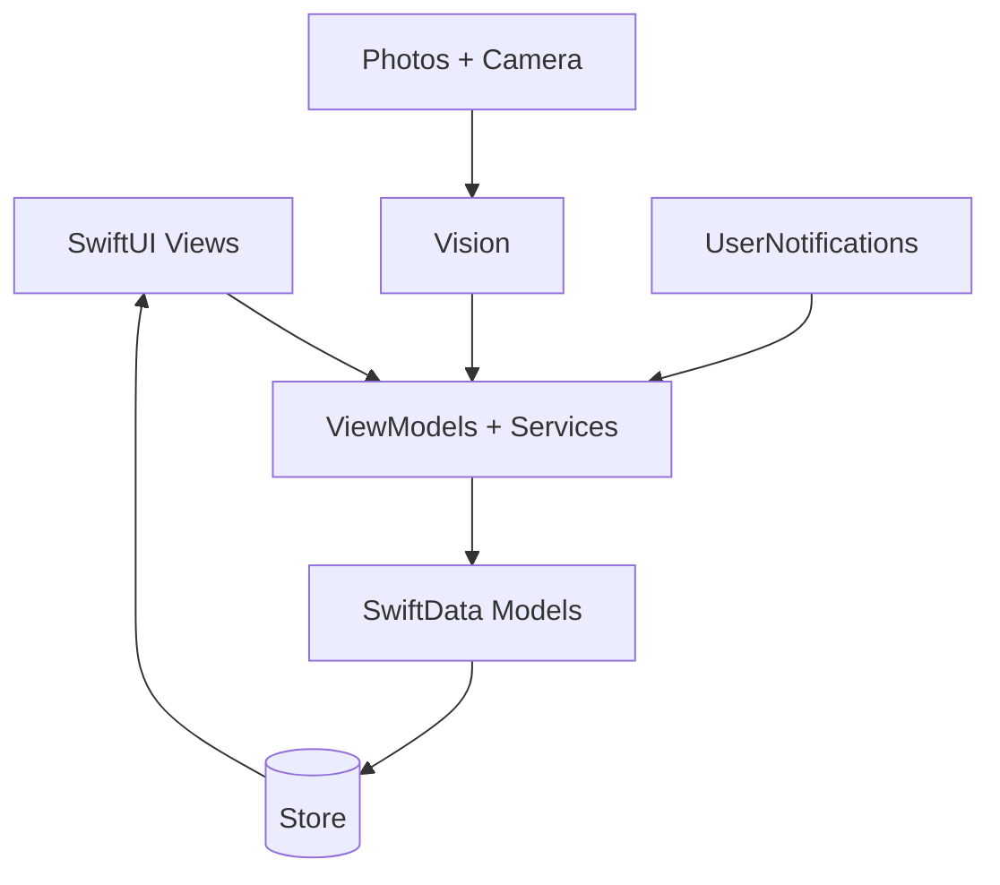

# Architecture


## Scheme



- **UI:** SwiftUI `NavigationStack`, `TabView`, `List` — all screens native. `ContentView` routes `OnboardingView` vs tabs.
- **VM/Services:** `Services/VisionService` (`ObservableObject`, `VNClassifyImageRequest`), `Services/NotificationService`, `Services/RecommendationService` (local rules). No cloud calls.
- **Models:** SwiftData `@Model` — see [Data Models](Data-Models)
- **Store:** SwiftData, `modelContainer(for: [Trip.self, PackingItem.self, ...])`, in-memory `ModelConfiguration` for tests, migrations handled by SwiftData, backup-safe.

## Stack

| Layer | Tech | Notes |
|---|---|---|
| Language | Swift 5.9 | `SWIFT_VERSION 5.9`, `IPHONEOS_DEPLOYMENT_TARGET 17.0` |
| UI | SwiftUI | `TARGETED_DEVICE_FAMILY 1,2` (iPhone + iPad) |
| Data | SwiftData | Offline, `ModelContainer`, `@Relationship(deleteRule: .cascade)` |
| Vision | Vision + VisionKit | `VisionService`, `VNClassifyImageRequest` |
| Media | Photos + Camera | Import + capture, privacy strings in `Info.plist` |
| Notifications | UserNotifications | Local only |
| Build | XcodeGen | `ios/project.yml` → `PackWise.xcodeproj` |
| Tests | Swift Testing + XCTest | `PackWiseTests` + `PackWiseUITests` |

## Navigation — no dead screens

`Launch → Onboarding (hasCompletedOnboarding) → Dashboard (upcoming/progress/missing) → Trips → Trip Detail (list+progress+search) → Item Detail → Photo Scanner → Outfit Planner → Library → Global Search → Templates → Reminders → Settings`

Every `NavigationLink`/`navigationDestination` is wired. Tabs: Dashboard, Trips, Scanner, Library, Search, More (Templates/Reminders/Settings).

## Folder

```
ios/PackWise/
  App/        PackWiseApp.swift, ContentView.swift
  Models/     Models.swift (all @Model + TemplateItem + constants)
  Services/   VisionService.swift, NotificationService.swift, RecommendationService.swift
  Views/      DashboardView, TripListView, TripDetailView, ItemDetailView, PhotoScannerView, LibraryView, GlobalSearchView, TemplateLibraryView, RemindersView, SettingsView, OnboardingView, NewTripSheet
  Resources/  Assets.xcassets, Info.plist
```

## Testing

- `PackWiseTests` — Swift Testing `@Suite` + `@Test` + `#expect`, in-memory `ModelContainer`, progress/missing, persistence, template round-trip, duplicate, prefs, reminder
- `PackWiseUITests` — `XCUIApplication` launch + tab smoke

```bash
cd ios && xcodegen generate
xcodebuild test -project PackWise.xcodeproj -scheme PackWise -destination "platform=iOS Simulator,name=iPhone 16,OS=latest" CODE_SIGNING_ALLOWED=NO
```

In CI tests are `continue-on-error` — IPA still builds if they flake (see [Build & Release](Build-and-Release)).
